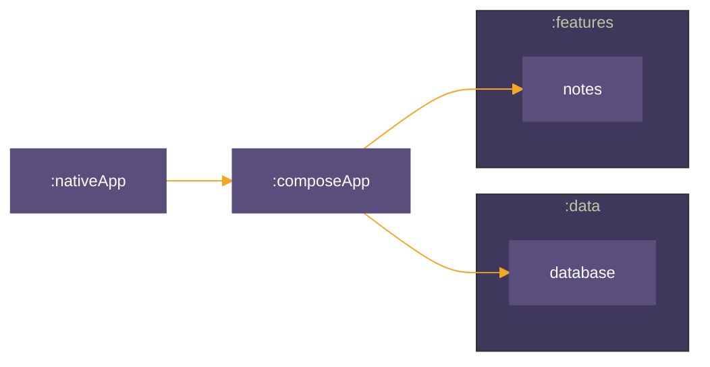

# kmp-sample-arch
Modular Kotlin Multiplatform Application Boilerplate


# Module Structure  




# Features
### Note Taking

| Android                                                                                                                    | iOS                                                                                                               |
|----------------------------------------------------------------------------------------------------------------------------|-------------------------------------------------------------------------------------------------------------------|
|   |  |

# Dependencies

compose = "1.7.0-beta02"  
compose-material3 = "1.3.0"  
compose-navigation = "2.8.0-alpha10"    
kotlinx-coroutines = "1.9.0-RC.2"  
kotlinx-serialization = "1.7.1"   
koin = "4.0.0"  
room = "2.7.0-alpha08"

# Build steps

1. Download Android Studio Lady Bug (https://developer.android.com/studio/preview)

2. Install kotlin multiplatform plugin (https://plugins.jetbrains.com/plugin/14936-kotlin-multiplatform)
    - Settings -> Plugins -> Marketplace -> Kotlin Multiplatform

3. Clone repository and open in Android Studio

4. 
```bash
git clone https://github.com/alexandrucaraus/kmp-sample-arch.git
```

4. Run configuration either android or ios (needs to be on a mac).