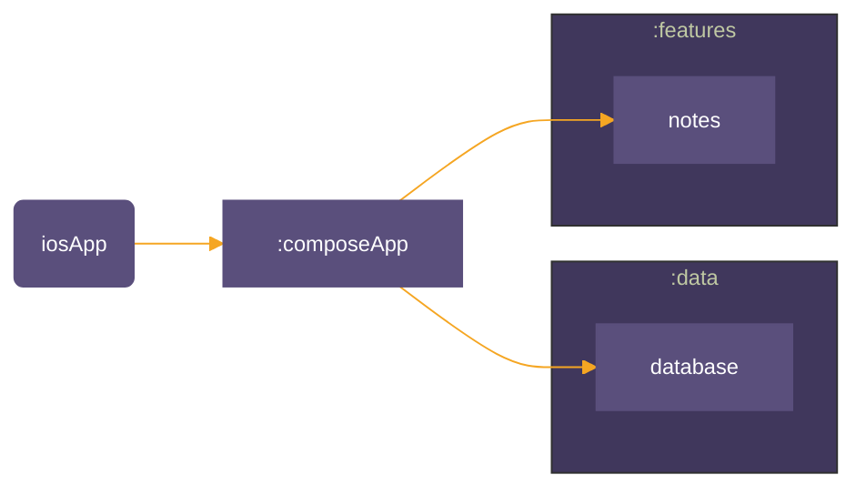

# kmp-sample-arch
Modular Kotlin Multiplatform Application Boilerplate

### Module Structure  

# Features
### Note Taking

| Android                                                                                                                    | iOS                                                                                                               |
|----------------------------------------------------------------------------------------------------------------------------|-------------------------------------------------------------------------------------------------------------------|
|   |  |

# Build steps
### 