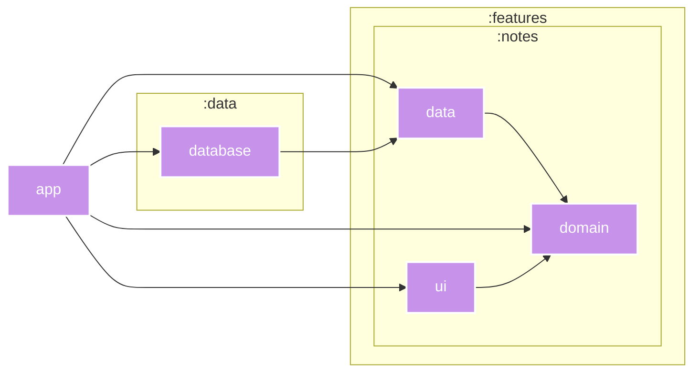

# kmp-sample-arch
Modular Kotlin Multiplatform Application Boilerplate

# Coverage

### TODOs

1. Test
 - Finish test setup for snapshot testing when paparazzi 2.0.0-alpha04 is ready

2. Test Coverage
  - Add kover for the common code report

3. CI/CD
   - Linters (ktlint, detekt) - done
   - Pre-push hook - done
   - Coverage display android and common separate, auto start emulator - ip
   - Build artifacts
   - Publish

### Modules Structure

```mermaid
%%{
  init: {
    'theme': 'neutrala'
  }
}%%

graph LR
  :app["app"]
  subgraph :features
    subgraph :notes
      :features:notes:data["data"]
      :features:notes:domain["domain"]
      :features:notes:domain["domain"]
      :features:notes:data["data"]
      :features:notes:ui["ui"]
      :features:notes:ui["ui"]
    end
  end
  subgraph :data
    :data:database["database"]
    :data:database["database"]
  end

  :features:notes:data --> :features:notes:domain
  :app --> :features:notes:domain
  :app --> :features:notes:data
  :app --> :features:notes:ui
  :app --> :data:database
  :features:notes:ui --> :features:notes:domain
  :data:database --> :features:notes:data

classDef kotlin-multiplatform fill:#C792EA,stroke:#fff,stroke-width:2px,color:#fff;
class :features:notes:data kotlin-multiplatform
class :features:notes:domain kotlin-multiplatform
class :app kotlin-multiplatform
class :features:notes:ui kotlin-multiplatform
class :data:database kotlin-multiplatform

```
# Features
### Note-Taking

| Android                                                                                                                    | iOS                                                                                                               |
|----------------------------------------------------------------------------------------------------------------------------|-------------------------------------------------------------------------------------------------------------------|
|   |  |

